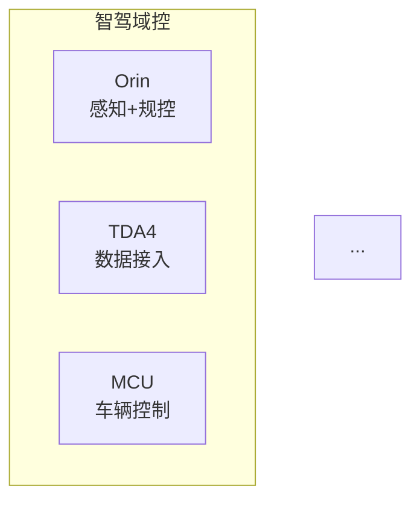

# Wombat-Blackboard 技术方案

> 版本: v1.0 | 日期: 2026-06-08 | 对应 PRD v1.1

---

## 1. 总览

### 1.1 架构图

```
┌─────────────────────────────────────────────────────────┐
│                       Browser                           │
│  ┌───────────────────────────────────────────────────┐  │
│  │                 React SPA (Vite)                   │  │
│  │  ┌──────────┐  ┌──────────┐  ┌──────────────────┐ │  │
│  │  │ 输入面板  │  │ 预览面板  │  │  代码 & 复制面板  │ │  │
│  │  │ (对话式)  │  │ (Mermaid)│  │  (Monaco/编辑)   │ │  │
│  │  └──────────┘  └──────────┘  └──────────────────┘ │  │
│  │         │              ▲              │            │  │
│  │         ▼              │              │            │  │
│  │  ┌──────────────────────────────────────────────┐  │  │
│  │  │           状态管理 (React Context)             │  │  │
│  │  │   messages[]  │  currentCode  │  diagramType │  │  │
│  │  └──────────────────────────────────────────────┘  │  │
│  └───────────────────────────────────────────────────┘  │
│                          │                              │
└──────────────────────────┼──────────────────────────────┘
                           │ HTTP POST /api/generate
                           ▼
┌─────────────────────────────────────────────────────────┐
│                   Node.js Backend                        │
│  ┌─────────────┐  ┌──────────────┐  ┌────────────────┐ │
│  │ Express API  │  │ Prompt Builder│  │  API Client    │ │
│  │ /api/generate│→│ + Glossary   │→│  (Anthropic SDK)│ │
│  │ /api/health  │  │ + Templates  │  │                 │ │
│  └─────────────┘  └──────────────┘  └────────┬────────┘ │
│                                               │          │
└───────────────────────────────────────────────┼──────────┘
                                                │
                                                ▼
                                    ┌─────────────────────┐
                                    │  DeepSeek API        │
                                    │  (Anthropic compat)  │
                                    │  model: v4-pro       │
                                    └─────────────────────┘
```

### 1.2 设计原则

- **薄后端** — 后端仅做 API 代理 + Prompt 组装，不存储状态，不引入数据库
- **富前端** — 对话上下文管理、Mermaid 渲染、语法校验全部在浏览器完成
- **无状态后端** — 每次请求携带完整对话历史，后端无 session（简化部署，方便横向扩展）
- **Prompt 即核心** — 系统效果 80% 取决于 Prompt 质量，代码架构为 Prompt 迭代服务

---

## 2. 技术栈

| 层 | 技术 | 版本 | 选型理由 |
|---|---|---|---|
| 前端框架 | React | 18+ | 生态成熟，Mermaid 渲染库有官方 React 封装 |
| 构建工具 | Vite | 5+ | 快速 HMR，零配置 TypeScript |
| UI 组件库 | Tailwind CSS | 3+ | 快速出 UI，不引入重型组件库 |
| 代码编辑器 | Monaco Editor (可选) / 简单 textarea | — | Phase 1 用 textarea，后续切换 Monaco |
| Mermaid 渲染 | `mermaid` npm 包 | 10+ | 官方库，浏览器端渲染 |
| 后端框架 | Express.js | 4+ | 简单够用，无额外抽象 |
| API SDK | `@anthropic-ai/sdk` | 最新 | 兼容 DeepSeek 的 Anthropic 格式 API |
| 运行时 | Node.js | 20+ | — |
| 语言 | TypeScript (前后端统一) | 5+ | 类型安全 |
| 部署 | Vercel (前端) + Vercel Serverless (后端) | — | 免费额度，零运维 |

---

## 3. 项目结构

```
wombat-blackboard/
├── docs/
│   ├── PRD.md                    # 产品需求文档
│   └── technical-solution.md     # 本文档
├── tests/
│   └── feishu-mermaid-compat.md  # 飞书兼容性测试（23/23 通过）
├── prompts/
│   ├── system-prompt.md          # 系统 Prompt 模板
│   ├── glossary.md               # 智驾领域术语词典
│   └── few-shot/                 # Few-shot 示例
│       ├── flowchart.md
│       ├── sequence.md
│       ├── state.md
│       ├── class.md
│       └── er.md
├── templates/                    # 领域模板（NL 描述）
│   ├── index.json                # 模板索引
│   ├── sensor-arch.md            # 传感器架构
│   ├── domain-controller.md      # 域控架构
│   ├── state-machine.md          # 功能状态机
│   ├── odd-decision-tree.md      # ODD 决策树
│   └── comm-topology.md          # 通信拓扑
├── server/                       # 后端
│   ├── src/
│   │   ├── index.ts              # Express 入口
│   │   ├── routes/
│   │   │   └── generate.ts       # /api/generate 路由
│   │   ├── services/
│   │   │   ├── prompt-builder.ts # Prompt 组装（glossary + template + history）
│   │   │   └── llm-client.ts     # Anthropic SDK 封装
│   │   └── config.ts             # 环境变量读取
│   ├── package.json
│   └── tsconfig.json
├── client/                       # 前端
│   ├── src/
│   │   ├── main.tsx              # React 入口
│   │   ├── App.tsx               # 根组件
│   │   ├── components/
│   │   │   ├── InputPanel.tsx    # 输入面板（对话式）
│   │   │   ├── PreviewPanel.tsx  # Mermaid 实时预览
│   │   │   ├── CodePanel.tsx     # 代码展示 + 复制
│   │   │   ├── TemplateSelector.tsx # 模板选择器
│   │   │   └── MessageBubble.tsx # 对话气泡
│   │   ├── hooks/
│   │   │   ├── useConversation.ts # 对话状态管理
│   │   │   └── useMermaidRender.ts # Mermaid 渲染 hook
│   │   ├── services/
│   │   │   └── api.ts            # 后端 API 调用
│   │   ├── types/
│   │   │   └── index.ts          # 共享类型定义
│   │   └── index.css             # Tailwind 入口
│   ├── index.html
│   ├── package.json
│   ├── tsconfig.json
│   ├── vite.config.ts
│   └── tailwind.config.js
├── shared/                       # 前后端共享
│   └── types.ts                  # 通用类型
└── package.json                  # 根 package.json (workspaces)
```

---

## 4. 前端设计

### 4.1 页面布局

```
┌──────────────────────────────────────────────────────────┐
│  Wombat-Blackboard                        [模板选择器 ▼] │
├────────────────────────┬─────────────────────────────────┤
│                        │                                 │
│   💬 对话区             │    📊 预览区                     │
│                        │                                 │
│  ┌──────────────────┐  │  ┌───────────────────────────┐ │
│  │ 用户: 智驾域控    │  │  │                           │ │
│  │ 有三个芯片...     │  │  │    (Mermaid 实时渲染)      │ │
│  │                  │  │  │                           │ │
│  │ 系统: [代码块]    │  │  │                           │ │
│  │ flowchart TD     │  │  │                           │ │
│  │   A[Orin]...     │  │  │                           │ │
│  │                  │  │  │                           │ │
│  │ 用户: 把 Orin    │  │  │                           │ │
│  │ 换成 J6          │  │  │                           │ │
│  │                  │  │  │                           │ │
│  │ 系统: [更新后的   │  │  │                           │ │
│  │  代码块]         │  │  │                           │ │
│  └──────────────────┘  │  └───────────────────────────┘ │
│                        │                                 │
│  ┌──────────────────┐  │                                 │
│  │ 输入你想画的场景  │  │                                 │
│  │ ...              │  │                                 │
│  │              [发送]│  │                                 │
│  └──────────────────┘  │                                 │
│                        │                                 │
├────────────────────────┴─────────────────────────────────┤
│  代码输出区                                     [复制代码] │
│  ┌──────────────────────────────────────────────────────┐│
│  │ flowchart TD                                         ││
│  │     A[智驾域控] --> B[感知模块]                        ││
│  │     B --> C[规控模块]                                 ││
│  │     ...                                              ││
│  └──────────────────────────────────────────────────────┘│
└──────────────────────────────────────────────────────────┘
```

### 4.2 组件树

```
App
├── Header
│   ├── Logo / Title
│   └── TemplateSelector        # 下拉选择领域模板
├── MainLayout (左右分栏)
│   ├── LeftPanel
│   │   ├── MessageList          # 对话历史
│   │   │   └── MessageBubble[]  # 每条消息（用户输入 / AI 代码）
│   │   └── InputPanel           # 输入框 + 发送按钮
│   └── RightPanel
│       └── PreviewPanel         # Mermaid 实时渲染
└── Footer
    └── CodePanel                # 当前代码 + 复制按钮
```

### 4.3 核心状态

```typescript
interface AppState {
  messages: Message[];           // 对话历史
  currentCode: string;           // 当前 Mermaid 代码
  diagramType: DiagramType;      // 当前图表类型（用于预览配置）
  isLoading: boolean;            // 是否等待 API 返回
  error: string | null;          // 错误信息
}

interface Message {
  id: string;
  role: 'user' | 'assistant';
  content: string;               // markdown: 用户 NL 或 AI 返回的代码块
  timestamp: number;
  mermaidCode?: string;          // 从 AI 回复中提取的纯 Mermaid 代码
}

type DiagramType = 'flowchart' | 'sequence' | 'state' | 'class' | 'er' | 'unknown';
```

### 4.4 Mermaid 实时预览

```typescript
// hooks/useMermaidRender.ts 核心逻辑
async function renderMermaid(code: string): Promise<string> {
  const id = `mermaid-${uniqueId()}`;
  const { svg } = await mermaid.render(id, code);
  return svg;  // 插入 DOM
}
```

错误处理：如果 `mermaid.render()` 抛出异常，捕获后：
1. 在预览区显示错误信息（红色提示）
2. 触发自动修复流程（见 Section 7）

### 4.5 复制功能

```typescript
async function copyCode(code: string) {
  await navigator.clipboard.writeText(code);
  // 显示 toast: "已复制，粘贴到飞书 /mermaid 即可"
}
```

---

## 5. 后端设计

### 5.1 API 端点

| 端点 | 方法 | 描述 |
|---|---|---|
| `/api/generate` | POST | 核心生成接口 |
| `/api/health` | GET | 健康检查 |

### 5.2 `/api/generate` 请求/响应

**Request:**
```typescript
POST /api/generate
Content-Type: application/json

{
  messages: {
    role: 'user' | 'assistant';
    content: string;
  }[];
  templateId?: string;   // 可选：使用的模板 ID
}
```

**Response:**
```typescript
// 成功
{
  success: true;
  content: string;        // LLM 原始返回（含 markdown 代码块）
  mermaidCode: string;    // 提取后的纯 Mermaid 代码
  diagramType: string;    // 检测到的图表类型
}

// 失败
{
  success: false;
  error: string;
}
```

### 5.3 Prompt 组装流程 (`prompt-builder.ts`)

```
buildSystemPrompt()
    │
    ├── 1. 加载 prompts/system-prompt.md（角色定义 + 输出规范）
    ├── 2. 注入 prompts/glossary.md（领域术语词典）
    ├── 3. 注入当前激活的模板 NL 描述（如果有）
    └── 4. 拼接 → 完整 system prompt

buildMessages()
    │
    ├── system: 上述 system prompt
    └── messages[]: 对话历史（user/assistant 交替）
```

### 5.4 LLM 调用 (`llm-client.ts`)

```typescript
import Anthropic from '@anthropic-ai/sdk';

const client = new Anthropic({
  apiKey: process.env.DEEPSEEK_API_KEY,
  baseURL: 'https://api.deepseek.com/anthropic',
});

async function generate(systemPrompt: string, messages: Message[]): Promise<string> {
  const response = await client.messages.create({
    model: 'deepseek-v4-pro',
    max_tokens: 4096,
    system: systemPrompt,
    messages: messages,
  });
  return response.content[0].text;
}
```

### 5.5 无状态设计

- 所有对话上下文由前端维护，每次请求全量携带
- 后端不做 session 存储、不做历史记录
- 好处：重启不丢数据、可水平扩展、调试简单

---

## 6. Prompt 工程

### 6.1 System Prompt 结构（核心）

```
┌────────────────────────────────────────────┐
│  1. 角色定义                                │
│     你是 Mermaid 代码生成器，专注于         │
│     汽车智能驾驶领域                         │
├────────────────────────────────────────────┤
│  2. 图表类型选择规则                         │
│     - 架构/拓扑/决策 → flowchart            │
│     - 交互/通信/调用 → sequence             │
│     - 状态流转/模式切换 → state             │
│     - 数据模型/接口 → class                 │
│     - 数据关系/信号矩阵 → er                │
├────────────────────────────────────────────┤
│  3. Mermaid 语法规范                        │
│     - 支持的节点形状、连线类型               │
│     - 中文标签要求                           │
│     - subgraph 用法                         │
│     - 代码块格式：```mermaid ... ```        │
├────────────────────────────────────────────┤
│  4. 领域术语词典（注入 glossary.md）          │
│     - 传感器/控制器/功能/通信/安全/ODD       │
│     - 术语 → 图表语义映射                    │
├────────────────────────────────────────────┤
│  5. 输出规范                                │
│     - 只输出代码块，不输出解释文字            │
│     - 一行代码不超过 80 字符                  │
│     - 节点 ID 用英文简写，标签用中文          │
│     - 布局方向优先 TD（上→下）               │
├────────────────────────────────────────────┤
│  6. 迭代修改规范                             │
│     - 用户要求修改时基于上一条代码增量修改     │
│     - 保持未提及部分不变                      │
│     - 只输出修改后的完整代码                  │
└────────────────────────────────────────────┘
```

### 6.2 图表类型选择规则（内置于 System Prompt）

| 用户描述特征 | → 图表类型 | 关键词 |
|---|---|---|
| "A 包含 B、C"、"架构"、"拓扑"、"连接" | `flowchart` | 架构、拓扑、连接、组成、包含 |
| "先...然后...再"、"交互"、"调用" | `sequence` | 交互、调用、请求、响应、发送 |
| "状态"、"切换"、"流转"、"从...到" | `state` | 状态、切换、流转、进入、退出 |
| "属性"、"方法"、"继承"、"接口" | `class` | 属性、方法、继承、接口、实现 |
| "一对多"、"属于"、"关系"、"字段" | `er` | 关系、属于、包含、字段、主键 |

### 6.3 Few-shot 示例策略

每种图表类型提供 2 个 few-shot 示例，格式为 `用户输入 → 期望输出`，选题全部来自智驾领域。示例文件放在 `prompts/few-shot/` 下，启动时加载并注入 system prompt。

示例结构：
```markdown
## 示例: Flowchart 系统架构

**用户输入:**
智驾域控有三个芯片：Orin 做感知规控，TDA4 做数据接入，MCU 做车辆控制。

**正确输出:**

```

### 6.4 领域术语词典设计 (`glossary.md`)

以结构化 YAML/Markdown 格式维护，用 `|` 分隔同义词：

```
传感器: Camera|摄像头, Radar|雷达, Lidar|激光雷达, USS|超声波, GNSS, IMU
控制器: 智驾域控|ADAS域控, Orin|Orin-X, TDA4, MCU, J6|征程6
功能: HWP|高速巡航, NOD|领航, TJP|堵车辅助, AEB|紧急制动, ACC|自适应巡航, LKA|车道保持
通信: CAN|CAN-FD, ETH|以太网, GMSL, LIN, SOME/IP, DDS
```

注入 system prompt 时展开为：
```
智驾领域术语：
- Camera/摄像头：车载前视/环视摄像头传感器
- Radar/雷达：毫米波雷达
- HWP/高速巡航：Highway Pilot，高速公路自动驾驶功能
...
```

---

## 7. 对话上下文与迭代修改

### 7.1 前端维护上下文

```typescript
// useConversation.ts
function useConversation() {
  const [messages, setMessages] = useState<Message[]>([]);

  async function sendMessage(userInput: string) {
    const newMessage: Message = { role: 'user', content: userInput };
    const updatedMessages = [...messages, newMessage];
    setMessages(updatedMessages);

    const response = await fetch('/api/generate', {
      method: 'POST',
      body: JSON.stringify({ messages: updatedMessages }),
    });

    const data = await response.json();
    const aiMessage: Message = {
      role: 'assistant',
      content: data.content,
      mermaidCode: data.mermaidCode,
    };
    setMessages([...updatedMessages, aiMessage]);
  }

  function reset() { setMessages([]); }

  return { messages, sendMessage, reset };
}
```

### 7.2 迭代修改示例

```
轮次 1:
  User: "智驾域控有三个芯片 Orin TDA4 MCU"
  AI: flowchart TD ... (生成架构图)

轮次 2:
  User: "把 Orin 换成 J6，增加一个交换机连接所有芯片"
  → 前端发送完整 messages 数组（含轮次 1 的上下文）
  → LLM 基于之前的代码增量修改
  → AI: flowchart TD ... (修改后的图，保持未提及部分不变)
```

### 7.3 上下文限制

- 保留最近 10 轮对话
- 超过 10 轮时，保留 system prompt + 最近 10 轮，丢弃更早的消息
- System prompt 不计入轮次

---

## 8. Mermaid 语法校验与自动修复

### 8.1 校验策略（双层）

```
LLM 返回代码
    │
    ▼
┌─────────────────────┐
│ Layer 1: 客户端渲染  │  mermaid.render() → 成功/失败
│  (浏览器端执行)      │
└─────────┬───────────┘
          │
     ┌────┴────┐
     │ 成功     │ 失败
     ▼         ▼
  显示预览  ┌──────────────────┐
            │ Layer 2: LLM 修复 │  把错误信息 + 原代码发回 LLM
            │ (后端重试)        │  请求修复语法错误
            └─────────┬────────┘
                      │
                      ▼
              重新渲染校验（最多 2 次）
```

### 8.2 前端渲染校验

```typescript
async function validateAndRender(code: string): Promise<{ svg: string } | { error: string }> {
  try {
    const svg = await renderMermaid(code);
    return { svg };
  } catch (e) {
    return { error: e.message };
  }
}
```

### 8.3 后端自动修复

```typescript
// 修复专用 prompt（追加到 messages 末尾）
const FIX_PROMPT = `
上面的 Mermaid 代码渲染时出现语法错误：
${errorMessage}

请修复语法错误后重新输出完整代码。只输出代码块，不要解释。
`;

// 最多重试 2 次
async function generateWithRetry(messages: Message[], systemPrompt: string): Promise<string> {
  for (let attempt = 0; attempt < 3; attempt++) {
    const code = await llmGenerate(systemPrompt, messages);
    const validation = validateSyntax(code);  // 后端用正则做基础校验

    if (validation.valid) return code;

    // 追加修复请求
    messages.push({ role: 'user', content: FIX_PROMPT.replace('${errorMessage}', validation.error) });
  }
  throw new Error('代码生成失败：超过最大重试次数');
}
```

> **注意**：后端校验只做正则基础检查（如括号匹配、关键字拼写）。真正的渲染校验在浏览器端由 Mermaid.js 完成。如果经过修复仍然渲染失败，前端展示错误信息并提示用户手动调整。

---

## 9. 模板系统

### 9.1 模板存储格式

每个模板是一个独立的 markdown 文件，包含自然语言描述（非预写代码）：

```markdown
# 传感器架构模板

## 自然语言描述
典型的 L2+ 智驾传感器架构，包含前视摄像头、环视摄像头、
毫米波雷达、超声波雷达、激光雷达，以及对应的数据链路。
请根据具体项目需求调整传感器数量和型号。

## 参数占位
- {前视摄像头数量}: 1-3
- {雷达数量}: 1-5
- {是否有激光雷达}: 是/否
- {域控型号}: Orin/TDA4/J6
```

### 9.2 模板索引

```json
// templates/index.json
[
  {
    "id": "sensor-arch",
    "name": "传感器架构",
    "description": "L2+ 智驾传感器拓扑架构",
    "category": "系统架构",
    "diagramType": "flowchart",
    "file": "sensor-arch.md"
  },
  {
    "id": "domain-controller",
    "name": "域控架构",
    "description": "智驾域控内部分层设计",
    "category": "系统架构",
    "diagramType": "flowchart",
    "file": "domain-controller.md"
  }
  // ...
]
```

### 9.3 模板使用流程

```
1. 用户选择模板（TemplateSelector 下拉）
2. 前端在请求中传入 templateId
3. 后端 prompt-builder 加载对应模板描述，注入 system prompt
4. 模板描述 + 用户补充描述 → 一起送入 LLM
5. LLM 基于模板场景 + 用户具体需求生成代码
```

### 9.4 默认模板行为

- 如果用户未选择模板，system prompt 不注入任何模板描述
- 用户可以直接输入场景描述，LLM 自行判断图表类型和内容
- 模板是"快捷入口"，不是必选项

---

## 10. 错误处理

### 10.1 前端错误状态

| 场景 | 处理 |
|---|---|
| API 网络错误 | 显示 "网络连接失败，请重试" + 重试按钮 |
| API 返回错误 | 显示后端返回的错误信息 |
| Mermaid 渲染失败 | 预览区显示红色错误提示 + 代码仍可复制（用户可以手动修复） |
| 复制失败 | 降级为选中文本 + 提示用户手动 Ctrl+C |
| 消息列表为空 | 显示引导文案："描述你想画的场景..." |

### 10.2 后端错误响应

```typescript
// 统一错误格式
{
  success: false,
  error: string,           // 用户可读的错误描述
  code: 'LLM_ERROR' | 'VALIDATION_ERROR' | 'INTERNAL_ERROR'
}
```

---

## 11. 开发与部署

### 11.1 本地开发

```bash
# 根目录
npm install                     # 安装所有 workspace 依赖

# 后端
cd server && npm run dev        # ts-node --watch, port 3001

# 前端
cd client && npm run dev        # Vite dev server, port 5173
                                 # proxy /api → localhost:3001
```

### 11.2 部署方案

```
┌─────────────────────────────────────┐
│              Vercel                  │
│                                     │
│  client/  → 静态资源 (CDN)          │
│  server/  →  Serverless Functions   │
│             (/api/* → handler)      │
│                                     │
│  环境变量:                           │
│    DEEPSEEK_API_KEY=sk-xxx         │
│    DEEPSEEK_BASE_URL=...           │
└─────────────────────────────────────┘
```

Vercel 原生支持前端 + Serverless 函数部署，无需额外配置反向代理。

### 11.3 环境变量

```bash
# server/.env
DEEPSEEK_API_KEY=sk-xxxxxxxx
DEEPSEEK_BASE_URL=https://api.deepseek.com/anthropic
DEEPSEEK_MODEL=deepseek-v4-pro
```

---

## 12. Phase 1 开发任务拆解

| # | 任务 | 预估 | 产出 |
|---|---|---|---|
| 1 | 项目脚手架搭建（Vite + Express + TS + Tailwind） | 0.5d | 可运行的空壳 |
| 2 | System Prompt 编写 + 领域术语词典 | 1d | `prompts/system-prompt.md`, `prompts/glossary.md` |
| 3 | Few-shot 示例编写（5 类型 × 2 = 10 个） | 0.5d | `prompts/few-shot/*.md` |
| 4 | 后端 `/api/generate` + Prompt 组装 + LLM 调用 | 1d | 可用的生成 API |
| 5 | 前端核心 UI（输入面板 + 代码面板 + 复制） | 1d | 基础可用的 UI |
| 6 | Mermaid 实时预览 + 语法校验 | 0.5d | 渲染 + 错误处理 |
| 7 | 对话上下文 + 迭代修改 | 0.5d | 多轮对话可用 |
| 8 | 模板系统（5 个模板 + 选择器） | 0.5d | 模板可用 |
| 9 | 错误处理 + UI 打磨 + 飞书粘贴指引 | 0.5d | 体验完善 |
| 10 | 部署 Vercel | 0.5d | 线上可访问 |

**总计：约 6-7 个工作日**

---

## 13. 风险与应对

| 风险 | 概率 | 影响 | 应对 |
|---|---|---|---|
| LLM 生成 Mermaid 语法错误率高 | 中 | 高 | 双层校验 + 自动修复机制（最多 2 次重试） |
| 飞书 Mermaid 版本与 mermaid.js 版本不一致 | 低 | 中 | 已实测 23/23 通过；后续关注飞书更新日志 |
| DeepSeek API 不稳定 | 低 | 中 | 后续支持切换 Claude API 作为备选 |
| 领域术语识别不准 | 中 | 中 | 术语词典持续迭代，用户手动纠正后反馈到 glossary |
| 复杂场景 LLM 理解偏差 | 中 | 中 | 对话式迭代修改弥补，单次准确率 80% + 修改后可用 |
