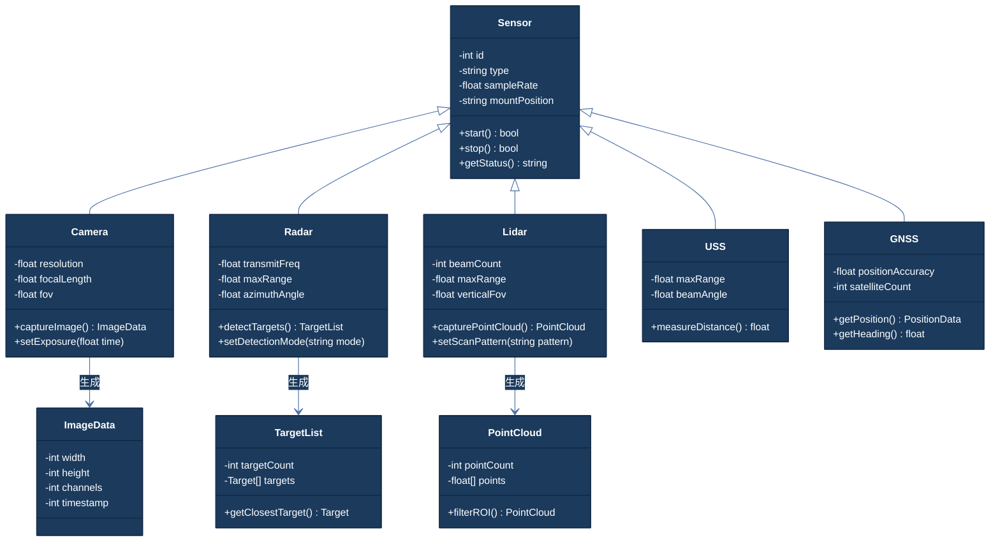

# 类图 Few-Shot 示例 Class Diagram Examples

## 示例 1：传感器数据模型

**用户输入：** 画智能驾驶传感器数据模型的类图。基类是传感器，有ID、类型、采样频率、安装位置四个属性和启动、停止两个方法。摄像头继承传感器，增加分辨率、焦距、视场角属性和图像采集方法。毫米波雷达继承传感器，增加发射频率、探测距离、探测角度属性和目标检测方法。激光雷达继承传感器，增加线束数、探测距离、垂直视场角属性和点云采集方法。超声波传感器继承传感器，增加探测距离和探测角度属性。组合导航模块继承传感器，增加定位精度属性和定位数据输出方法。

**正确输出：**



---

## 示例 2：智能驾驶域控制器接口定义

**用户输入：** 画智能驾驶域控制器的接口类图。核心接口IController定义初始化、启动和停止方法。抽象类DomainController实现IController，添加MCU和SoC的引用属性，以及健康检查和故障处理方法。智驾域控制器ADASController继承DomainController，添加传感器管理属性和感知融合、规划决策方法，实现自动驾驶相关接口IDrivingInterface。座舱域控制器CabinController也继承DomainController，添加娱乐系统和显示系统属性。安全监控SafetyMonitor单独定义，引用DomainController做故障监控。

**正确输出：**

```mermaid
%%{init: {'theme': 'base', 'themeVariables': {'primaryColor': '#1B3A5C', 'primaryTextColor': '#fff', 'primaryBorderColor': '#0F2440', 'lineColor': '#4A6FA5', 'secondaryColor': '#E8EDF3', 'tertiaryColor': '#F5F7FA', 'fontSize': '14px', 'clusterBkg': '#F5F7FA', 'clusterBorder': '#D0D8E3', 'edgeLabelBackground': '#fff'}}}%%
classDiagram
    class IController {
        <<interface>>
        +init() bool
        +start() bool
        +stop() bool
        +reset() bool
        +selfDiagnose() DiagResult
    }

    class DomainController {
        <<abstract>>
        -MCU mcu
        -SoC soc
        -string domainName
        -int errorCount
        +healthCheck() HealthStatus
        +handleFault(string faultCode) bool
        +logStatus() string
    }

    class ADASController {
        -Sensor[] sensors
        -FusionEngine fusionEngine
        -PlanningModule planningModule
        -ControlModule controlModule
        +sensorFusion() EnvironmentModel
        +planTrajectory() Trajectory
        +executeControl() ControlCmd
        +checkODDConditions() ODDResult
        +getSystemStatus() ADASStatus
    }

    class CabinController {
        -InfotainmentSystem infotainment
        -DisplaySystem displays
        -AudioSystem audio
        +showNavigation(string route)
        +playMedia(string source)
        +adjustClimate(float temp)
    }

    class IDrivingInterface {
        <<interface>>
        +getEnvironmentModel() EnvironmentModel
        +getVehicleState() VehicleState
        +executeCommand(DriveCmd cmd) bool
        +requestModeChange(DriveMode mode) bool
    }

    class SafetyMonitor {
        -DomainController[] monitoredControllers
        -int faultThreshold
        +monitorHealth() void
        +reportFault(string source, string code)
        +triggerFailSafe() bool
    }

    class MCU {
        -int coreCount
        -float freq
        -int flashSize
        +executeSafetyTask()
    }

    class SoC {
        -int cpuCores
        -int gpuCores
        -int npuTOPS
        +runPerception()
        +runPlanning()
    }

    IController <|.. DomainController
    DomainController <|-- ADASController
    DomainController <|-- CabinController
    IDrivingInterface <|.. ADASController
    ADASController *-- MCU : 包含
    ADASController *-- SoC : 包含
    SafetyMonitor --> DomainController : 监控
