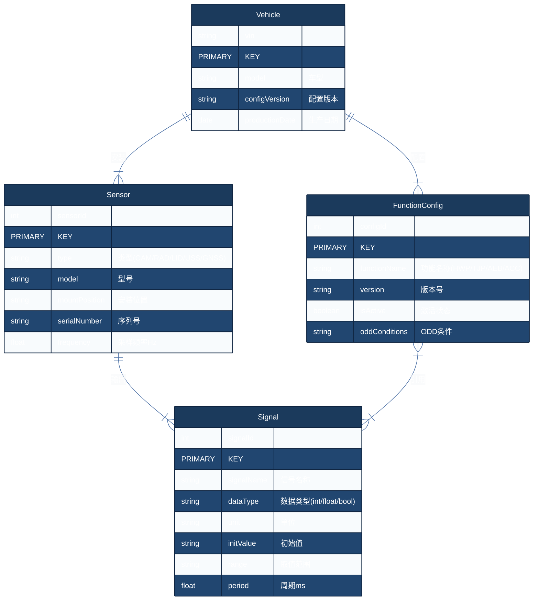
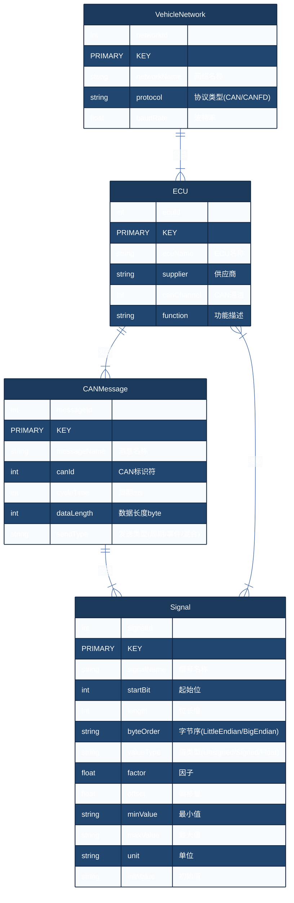

# ER图 Few-Shot 示例 ER Diagram Examples

## 示例 1：车辆-传感器-信号实体关系模型

**用户输入：** 画车辆、传感器、信号和功能配置的实体关系图。一辆车可以安装多个传感器，一个传感器只能属于一辆车。一个传感器可以输出多个信号，一个信号只能由一个传感器输出。一个功能配置可以引用多个信号，一个信号也可以被多个功能配置引用。一辆车可以有多个功能配置，一个功能配置只属于一辆车。实体属性：车辆有VIN码、车型、配置版本和生产日期。传感器有传感器ID、类型、型号、安装位置和序列号。信号有信号ID、信号名称、数据类型、初始值和取值范围。功能配置有配置ID、功能名称、版本号和激活状态。

**正确输出：**



---

## 示例 2：CAN信号矩阵与ECU映射

**用户输入：** 画CAN通信的信号矩阵ER图。一个整车网络包含多个ECU节点，一个ECU可以发送多个CAN消息，一个CAN消息只能由一个ECU发送。一个CAN消息包含多个信号，一个信号只能属于一个消息。一个ECU可以接收多个信号，一个信号可以被多个ECU接收。实体属性：ECU有ECU编号、名称、供应商和CAN通道。CAN消息有消息ID、消息名称、周期、数据长度和发送类型。信号有信号名、起始位、长度、字节序、类型、因子、偏移量和取值范围。

**正确输出：**



---

## 示例 3：功能安全完整性等级需求模型

**用户输入：** 画功能安全需求管理的实体关系模型。一个安全目标包含多个功能安全需求，一个功能安全需求可以分解为多个技术安全需求。一个技术安全需求可以分配到多个系统元素（传感器、控制器、执行器）。每个系统元素可以有多个故障模式，一个故障模式可以关联多个安全机制。实体的属性包括：安全目标有目标ID、描述和ASIL等级。功能安全需求有需求ID、描述、ASIL等级和状态。系统元素有元素ID、名称、类型和ASIL能力。故障模式有故障ID、故障类型、检测方法和FTTI。安全机制有机制ID、机制类型、诊断覆盖率和冗余等级。

**正确输出：**

```mermaid
%%{init: {'theme': 'base', 'themeVariables': {'primaryColor': '#1B3A5C', 'primaryTextColor': '#fff', 'primaryBorderColor': '#0F2440', 'lineColor': '#4A6FA5', 'secondaryColor': '#E8EDF3', 'tertiaryColor': '#F5F7FA', 'fontSize': '14px', 'clusterBkg': '#F5F7FA', 'clusterBorder': '#D0D8E3', 'edgeLabelBackground': '#fff'}}}%%
erDiagram
    SafetyGoal ||--|{ FuncSafetyReq : "分解为"
    FuncSafetyReq ||--|{ TechSafetyReq : "细化"
    TechSafetyReq }|--|| SystemElement : "分配到"
    SystemElement ||--|{ FailureMode : "具有"
    FailureMode ||--|{ SafetyMechanism : "覆盖"
    SafetyGoal ||--|| ASIL : "等级"

    SafetyGoal {
        int goalId PRIMARY KEY
        string description "安全目标描述"
        string asilLevel "ASIL等级"
        string status "状态"
    }

    FuncSafetyGoal {
        int goalId PRIMARY KEY
        string description "功能安全目标"
        string asilLevel "ASIL等级"
        string status "状态"
    }

    FuncSafetyReq {
        int reqId PRIMARY KEY
        string description "功能安全需求描述"
        string asilLevel "ASIL等级(A/B/C/D/QM)"
        string status "状态(已分配/已实现/已验证)"
        float ftti "故障容错时间ms"
    }

    TechSafetyReq {
        int reqId PRIMARY KEY
        string description "技术安全需求描述"
        string asilLevel "ASIL等级"
        string allocatedElement "分配系统元素"
    }

    SystemElement {
        int elementId PRIMARY KEY
        string elementName "元素名称"
        string elementType "类型(Sensor/Controller/Actuator)"
        string asilCapability "ASIL能力"
        int safetyIntegrity "安全完整性等级"
    }

    FailureMode {
        int failureId PRIMARY KEY
        string failureType "故障类型"
        string description "故障描述"
        string detectionMethod "检测方法"
        float ftti "故障容错时间ms"
        string faultTolerantTime "故障容错时间"
    }

    SafetyMechanism {
        int mechanismId PRIMARY KEY
        string mechanismType "机制类型"
        float diagnosticCoverage "诊断覆盖率%"
        string redundancyLevel "冗余等级"
        int faultResponseTime "故障响应时间ms"
    }

    ASIL {
        string level PRIMARY KEY
        string definition "定义"
        int severity "严重度S"
        int exposure "暴露率E"
        int controllability "可控性C"
    }

    SafetyGoal ||--|{ FuncSafetyReq : "分解为"
    FuncSafetyReq ||--|{ TechSafetyReq : "细化为"
    TechSafetyReq }|--|| SystemElement : "分配到"
    SystemElement ||--|{ FailureMode : "具有潜在故障"
    FailureMode ||--|{ SafetyMechanism : "通过安全机制覆盖"
