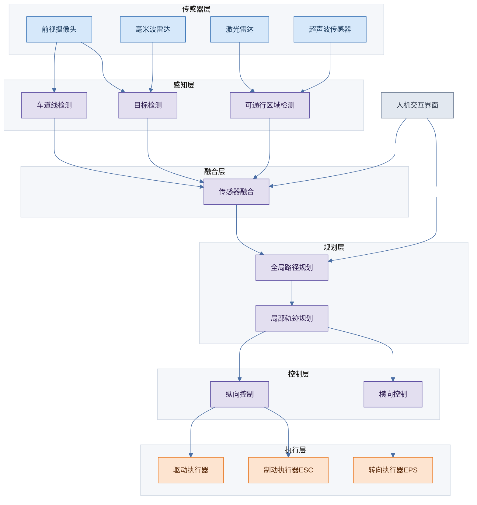
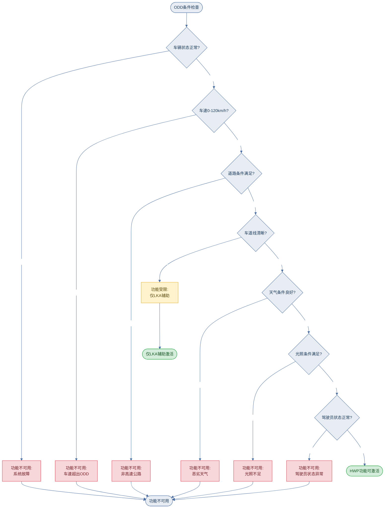

# 流程图 Few-Shot 示例 Flowchart Examples

## 示例 1：智能驾驶系统架构图

**用户输入：** 画智能驾驶系统架构图，传感器层包括前视摄像头、毫米波雷达、激光雷达和超声波传感器；感知层包括目标检测、车道线检测和可通行区域检测；融合层做传感器融合；规划层分全局规划和局部规划；控制层分横向控制和纵向控制；执行层包括转向、制动和驱动。最后是人机交互界面。

**正确输出：**



---

## 示例 2：高速领航HWP功能ODD条件决策树

**用户输入：** 画一个HWP功能激活的ODD条件检查决策树。先检查车辆状态：车速是否在0-120km/h范围内，系统是否无故障。然后检查道路条件：是否是高速公路、车道线是否清晰。再检查环境条件：天气是否良好（无雨雪雾），光照是否充足（白天或夜间有路灯）。最后检查驾驶员状态：驾驶员是否存在、是否目视前方。所有条件满足则HWP可激活，否则提示相应原因。

**正确输出：**



---

## 示例 3：AEB自动紧急制动系统架构

**用户输入：** 画AEB系统的架构图。输入来自前视摄像头和前向毫米波雷达。感知融合模块融合视觉和雷达数据做目标检测和跟踪。决策模块计算碰撞时间TTC，判断是否需要预警或制动。预警触发FCW报警（声音和视觉），制动触发制动请求给ESC执行器。同时有HMI显示报警状态。

**正确输出：**

```mermaid
flowchart TD
    subgraph Input["输入层"]
        CAM[前视摄像头]
        RAD[前向毫米波雷达]
    end
    subgraph Perception["感知层"]
        FUS_AEB[感知融合]
        DET_AEB[目标检测与跟踪]
    end
    subgraph Decision["决策层"]
        TTC_CALC[TTC碰撞时间计算]
        DEC_AEB{碰撞风险判断}
    end
    subgraph Output["输出层"]
        FCW_ALERT[FCW前向碰撞预警]
        BRK_REQ[制动请求]
    end
    subgraph HMI_AEB["人机交互"]
        SOUND_ALERT[声音报警]
        VIS_ALERT[视觉报警]
    end
    ESC_AEB[制动执行器ESC]
    CAM --> FUS_AEB
    RAD --> FUS_AEB
    FUS_AEB --> DET_AEB
    DET_AEB --> TTC_CALC
    TTC_CALC --> DEC_AEB
    DEC_AEB -->|TTC > 2.6s| SAFE[安全-无动作]
    DEC_AEB -->|1.6s < TTC <= 2.6s| FCW_ALERT
    DEC_AEB -->|TTC <= 1.6s| BRK_REQ
    DEC_AEB -->|TTC <= 0.8s| BRK_REQ
    FCW_ALERT --> SOUND_ALERT
    FCW_ALERT --> VIS_ALERT
    BRK_REQ --> ESC_AEB
    ESC_AEB -->|制动完成| DEC_AEB
