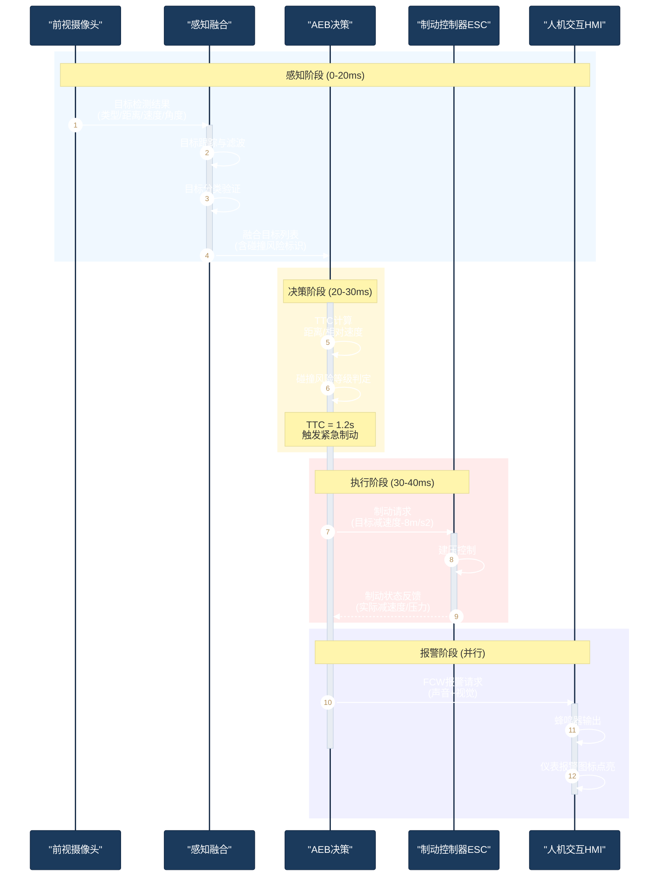
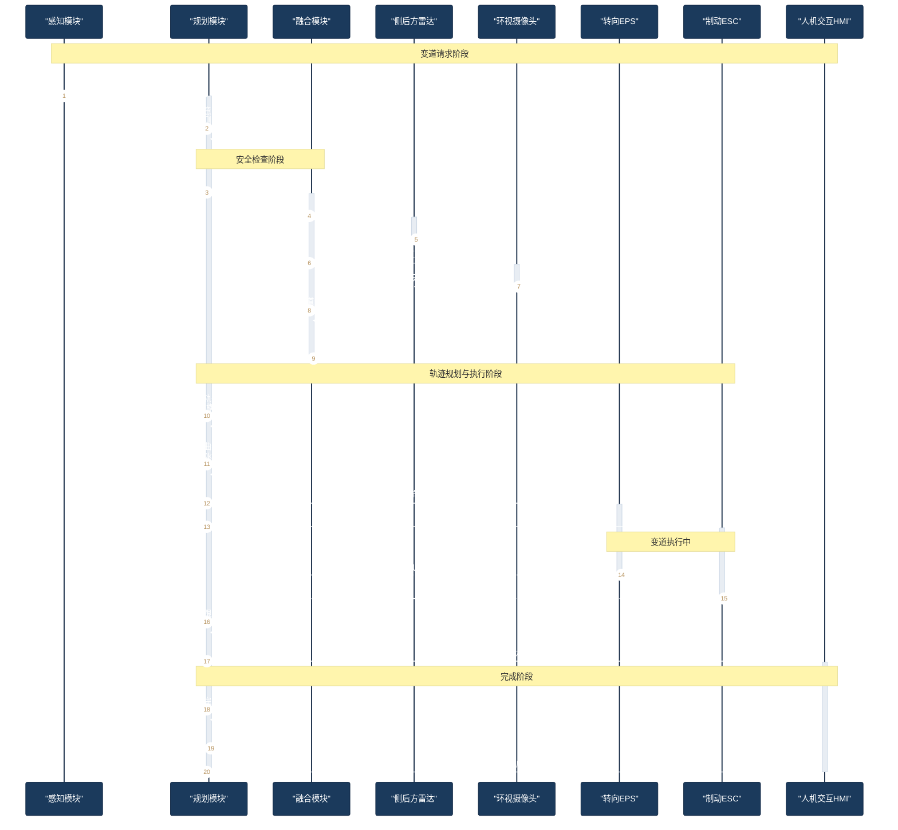

# 时序图 Few-Shot 示例 Sequence Diagram Examples

## 示例 1：AEB紧急制动完整交互流程

**用户输入：** 画AEB紧急制动时各模块的交互时序。前视摄像头检测到前方障碍物，将目标数据发送给感知融合模块。感知融合对目标进行跟踪和分类，然后发送给AEB决策模块。AEB决策模块计算TTC，发现小于1.6秒，于是发送制动请求给制动控制器ESC。ESC执行制动并将制动状态反馈给AEB决策模块。同时AEB决策模块发送报警请求给HMI模块，HMI发出声音和视觉报警。整个过程需要在40ms内完成。

**正确输出：**



---

## 示例 2：HWP高速领航变道超车场景

**用户输入：** 画HWP功能下车辆自动变道超车的交互时序。首先感知模块检测到前方慢车，请求规划模块变道。规划模块确认目标车道安全条件，向融合模块请求目标车道状态。融合模块查询侧后方毫米波雷达和环视摄像头确认目标车道无来车。融合模块将目标车道状态返回给规划模块。规划模块生成变道轨迹，发给横向控制EPS和纵向控制ESC。EPS执行转向变道，ESC调整车速。完成后反馈给规划模块，规划模块再通知HMI显示变道完成。

**正确输出：**



---

## 示例 3：系统上电与自检时序

**用户输入：** 画智能驾驶系统上电启动的时序。用户上电后，VCU唤醒智驾域控。智驾域控自检，分别检查MCU状态、SoC状态、传感器状态。MCU自检通过后回复。SoC自检包括内存和算法模型加载。传感器自检依次检查前视摄像头、毫米波雷达和激光雷达，每个传感器回复自检结果。所有自检通过后，智驾域控向VCU报告系统就绪。VCU通知HMI显示系统正常。

**正确输出：**

```mermaid
%%{init: {'theme': 'base', 'themeVariables': {'primaryColor': '#1B3A5C', 'primaryTextColor': '#fff', 'primaryBorderColor': '#0F2440', 'lineColor': '#4A6FA5', 'secondaryColor': '#E8EDF3', 'tertiaryColor': '#F5F7FA', 'fontSize': '14px', 'clusterBkg': '#F5F7FA', 'clusterBorder': '#D0D8E3', 'edgeLabelBackground': '#fff'}}}%%
sequenceDiagram
    autonumber
    participant VCU as "整车控制器VCU"
    participant DC as "智驾域控制器"
    participant MCU as "安全MCU"
    participant SOC as "智驾SoC"
    participant CAM as "前视摄像头"
    participant RAD as "毫米波雷达"
    participant LID as "激光雷达"
    participant HMI as "仪表HMI"

    VCU->>DC: 唤醒信号(IGN_ON)
    activate DC
    Note over DC: 系统启动 (Boot)

    par 并行自检
        DC->>MCU: MCU状态查询
        activate MCU
        MCU->>MCU: 自检(电源/时钟/看门狗)
        MCU-->>DC: MCU自检通过
        deactivate MCU
    and
        DC->>SOC: SoC状态查询
        activate SOC
        SOC->>SOC: 内存自检
        SOC->>SOC: 算法模型加载
        SOC-->>DC: SoC自检通过
        deactivate SOC
    and
        DC->>CAM: 摄像头自检
        activate CAM
        CAM-->>DC: 摄像头OK
        deactivate CAM
        DC->>RAD: 雷达自检
        activate RAD
        RAD-->>DC: 雷达OK
        deactivate RAD
        DC->>LID: 激光雷达自检
        activate LID
        LID-->>DC: 激光雷达OK
        deactivate LID
    end

    DC->>DC: 系统级健康诊断
    Note over DC: 所有子系统状态正常
    DC-->>VCU: 系统就绪信号
    deactivate DC
    VCU->>HMI: 显示系统状态正常
    activate HMI
    HMI-->>VCU: 显示完成
    deactivate HMI
