# 飞书 Mermaid 兼容性测试用例

> 使用方法：逐个代码块复制到飞书文档，输入 `/mermaid` 后粘贴，观察渲染结果。
> 每个测试用例标注了 \*\*必须通过\*\* / \*\*重要\*\* / \*\*锦上添花\*\* 三个优先级。

\---

## 1\. Flowchart 基础节点形状【必须通过】

```mermaid
flowchart LR
    A\[矩形节点]
    B(圆角节点)
    C{菱形判断}
    D(\[体育场形])
    E\[\[子程序形]]
    F\[(圆柱形)]
    G((圆形))
    H>不对称形]
    I{{六边形}}
```

## 2\. Flowchart 连接线与标签【必须通过】

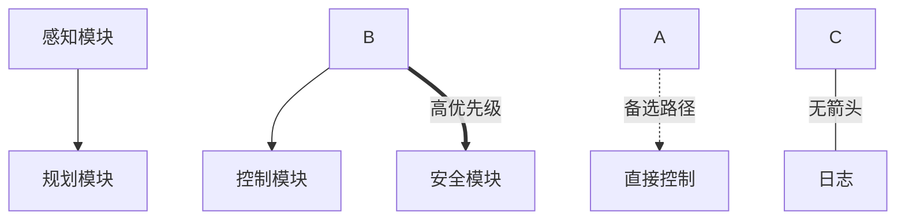

## 3\. Flowchart 子图 (subgraph)【必须通过】

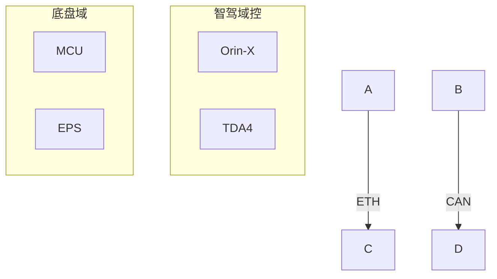

## 4\. Flowchart 子图嵌套 + 方向【重要】

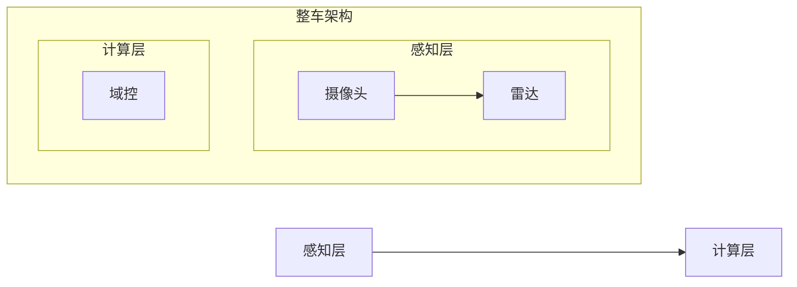

## 5\. Flowchart 中文节点 + 长文本 + 换行【必须通过】

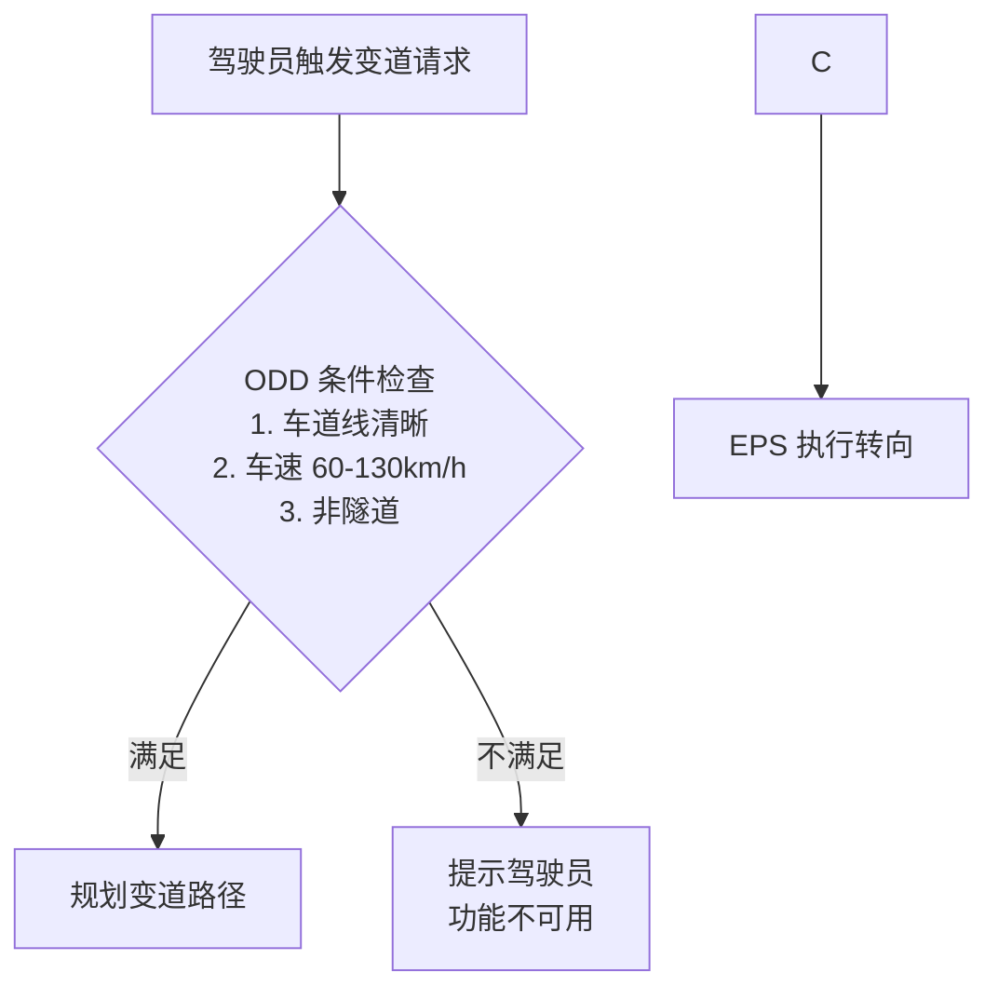

## 6\. Sequence 基础语法 + 中文【必须通过】

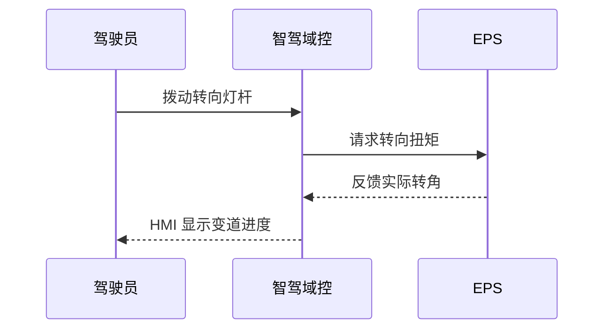

## 7\. Sequence 高级语法 (loop/alt/par)【必须通过】

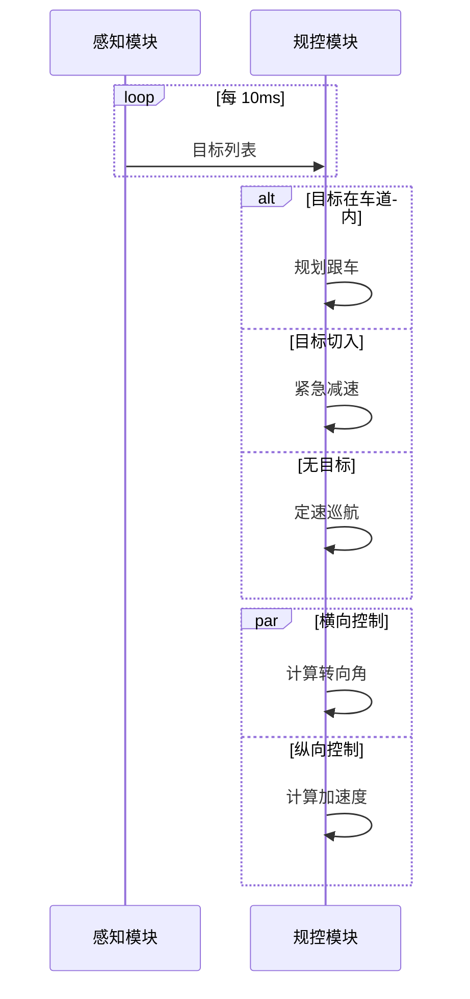

## 8\. Sequence 激活框 + 注释【重要】

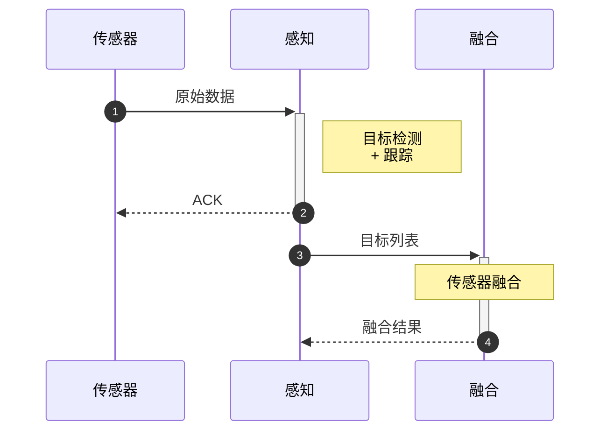

## 9\. State 基础状态图【必须通过】

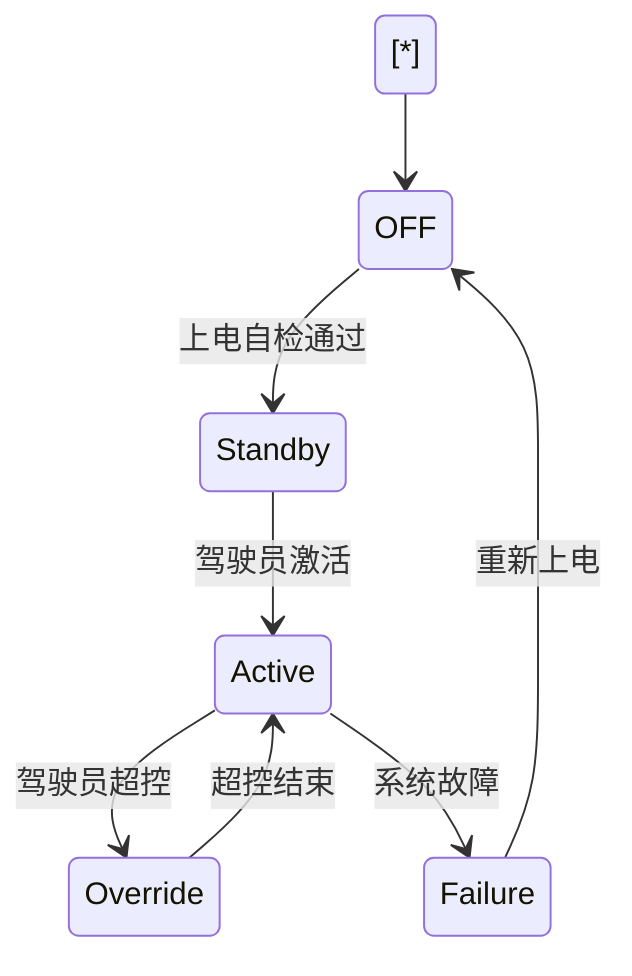

## 10\. State 复合状态 + 子状态【必须通过】

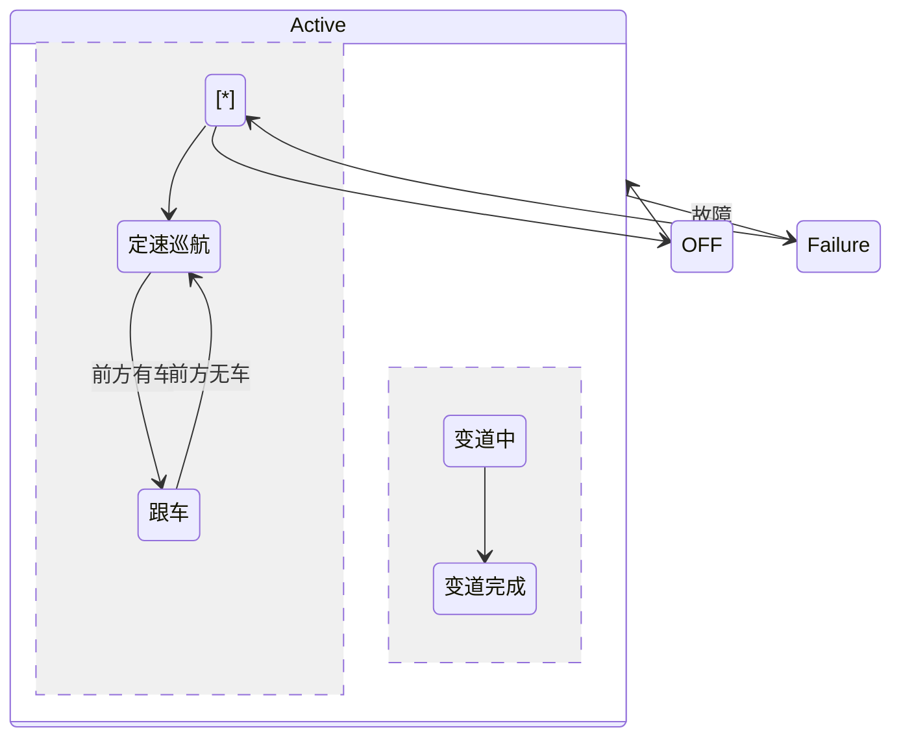

## 11\. State 条件选择 + 分叉汇合【重要】

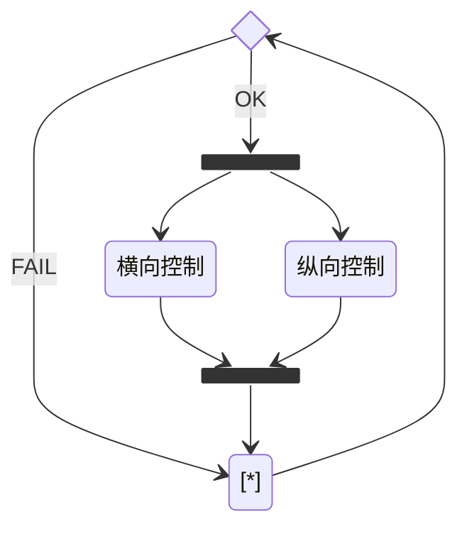

## 12\. State 历史状态【锦上添花】

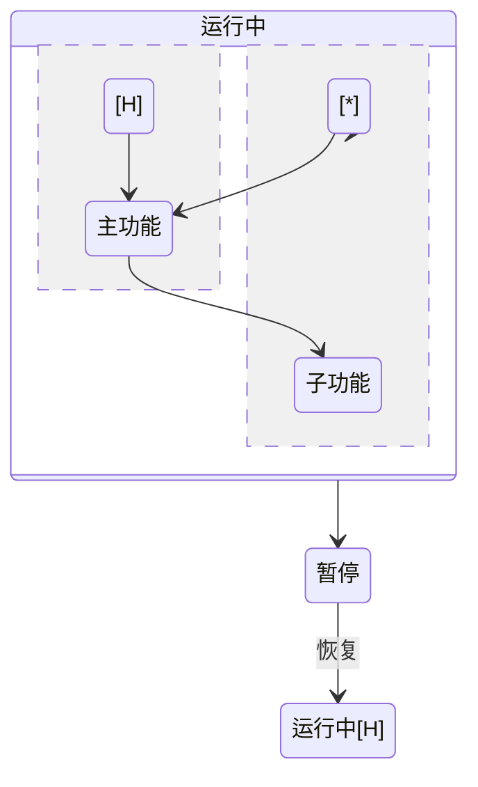

## 13\. Class 类图基础【必须通过】

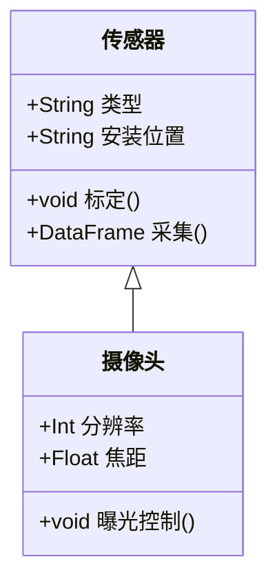

## 14\. Class 关系类型【重要】

```mermaid
classDiagram
    class 域控 {
        +String 型号
    }
    class 芯片 {
        +String 型号
        +Int 算力
    }
    class 传感器 {
        +String 类型
    }
    class 执行器 {
        +String 类型
    }
    
    域控 \*-- 芯片 : 组成
    域控 o-- 传感器 : 聚合
    域控 --> 执行器 : 控制
    芯片 ..> 传感器 : 依赖
```

## 15\. Class 抽象类 + 接口【锦上添花】

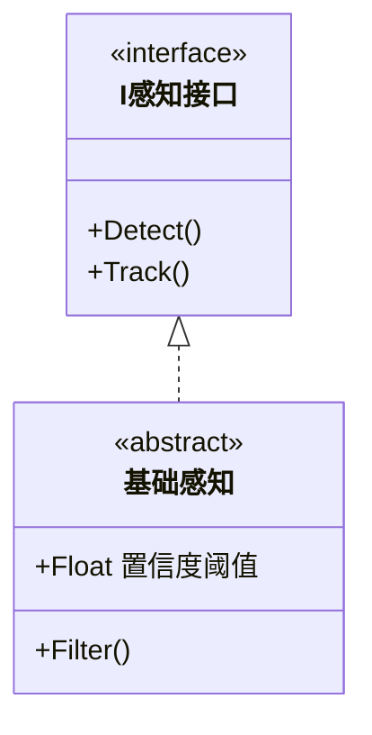

## 16\. ER 实体关系图【重要】

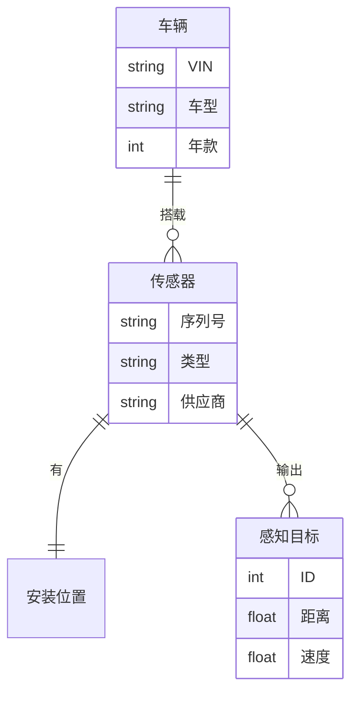

## 17\. Pie 饼图【锦上添花】

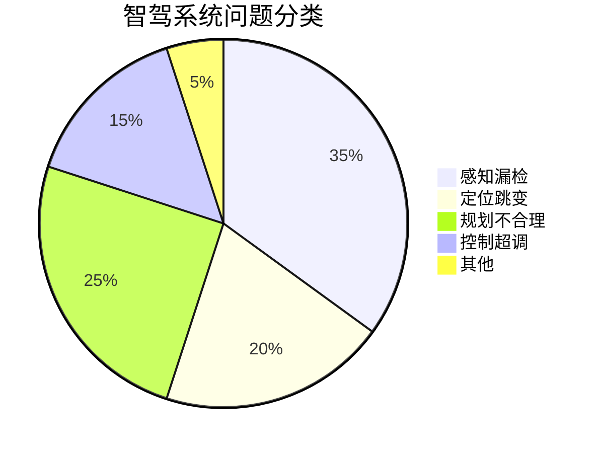

## 18\. Mindmap 思维导图【锦上添花】

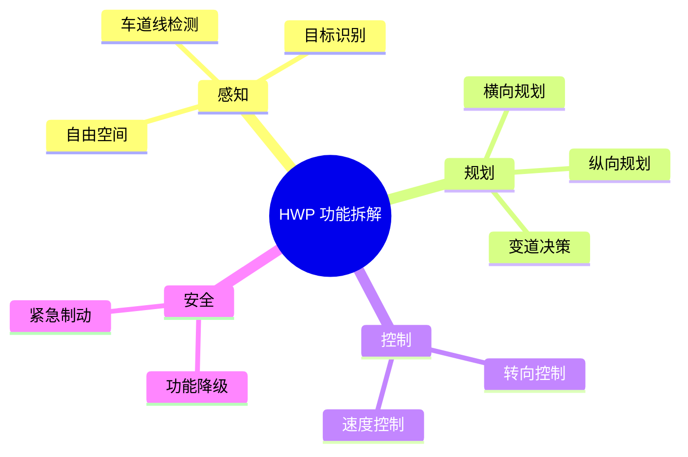

## 19\. Timeline 时间线【锦上添花】

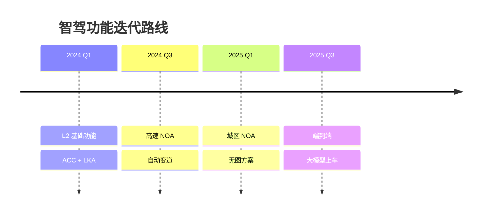

## 20\. Gantt 甘特图【锦上添花】

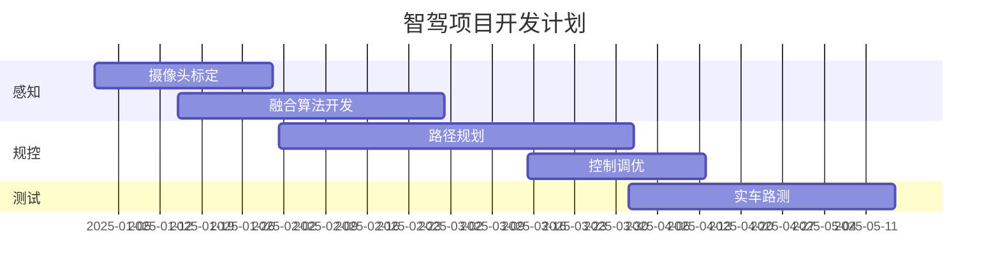

## 21\. `%%{init}%%` 主题设置【重要】

```mermaid
%%{init: {'theme': 'forest'}}%%
flowchart TD
    A\[感知] --> B\[规划]
    B --> C\[控制]
    C --> D\[执行]
```

## 22\. `%%{init}%%` 自定义颜色【重要】

```mermaid
%%{init: {'theme': 'base', 'themeVariables': { 'primaryColor': '#ff6b35', 'primaryTextColor': '#fff', 'lineColor': '#004e98' }}}%%
flowchart LR
    A\[传感器数据] --> B\[感知处理]
    B --> C\[融合输出]
```

## 23\. `%%{init}%%` 自定义字体大小【锦上添花】

```mermaid
%%{init: {'theme': 'default', 'fontSize': '20px'}}%%
flowchart LR
    A\[大字标题] --> B\[正文内容]
```

\---

## 测试结果记录

|#|测试项|结果 (通过/部分/失败)|备注|
|-|-|-|-|
|1|Flowchart 基础节点形状|通过||
|2|Flowchart 连接线与标签|通过||
|3|Flowchart subgraph|通过||
|4|Flowchart subgraph 嵌套+方向|通过||
|5|Flowchart 中文+长文本+换行|通过||
|6|Sequence 基础+中文|通过||
|7|Sequence loop/alt/par|通过||
|8|Sequence 激活框+autonumber|通过||
|9|State 基础状态图|通过||
|10|State 复合状态+子状态|通过||
|11|State 条件选择+分叉汇合|通过||
|12|State 历史状态|通过||
|13|Class 类图基础|通过||
|14|Class 关系类型|通过||
|15|Class 抽象类+接口|通过||
|16|ER 实体关系图|通过||
|17|Pie 饼图|通过||
|18|Mindmap 思维导图|通过||
|19|Timeline 时间线|通过||
|20|Gantt 甘特图|通过||
|21|%%{init}%% 主题|通过||
|22|%%{init}%% 自定义颜色|通过||
|23|%%{init}%% 自定义字体|通过||


